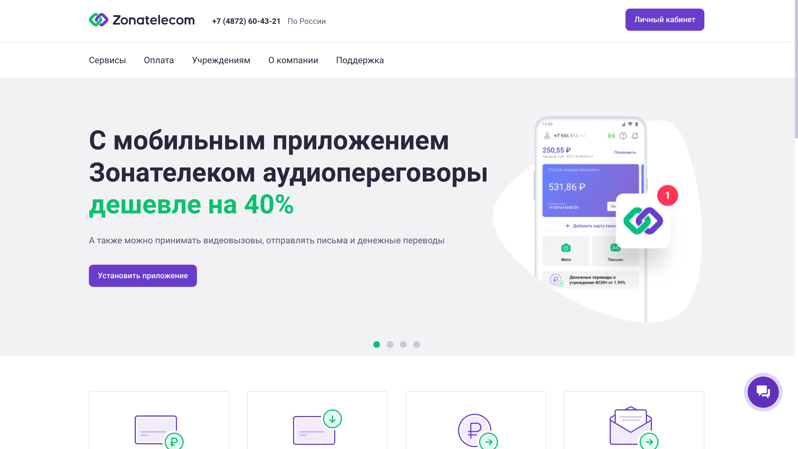
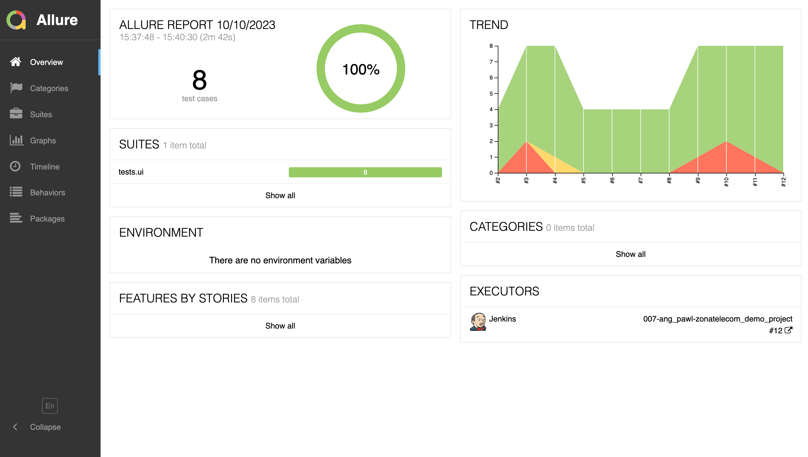
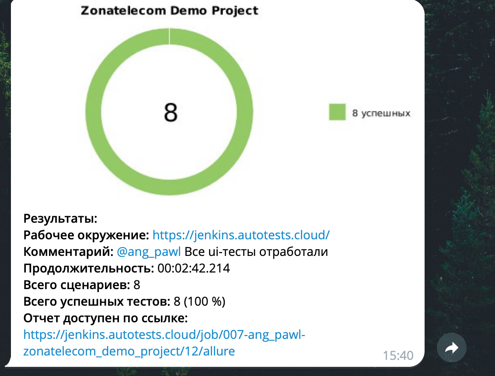

# Демонстрационный проект по организации автотестов для лендинга компании <a target="_blank" href="https://www.zonatelecom.ru/">Zonatelecom</a>



### Стек технологий:
<code></code>
<code></code>
<code></code>
<code></code>
<code></code>
<code></code>
<code></code>
<code></code>
<code></code>
<code></code>
<code></code>

### Реализованные проверки:
- UI:
  - Наименования разделов сайта в верхнем меню указаны корректно
  - В хедере сайта присутствует и отображается логотип компании
  - В хедере сайта присутствует и отображается номер телефона компании
  - Успешно открываются разделы сайта и сторонние ресурсы по кнопкам баннера
  - Успешно открывается страница авторизации
- API:
  - get-запрос ресурса index.json возвращает 200 статус-код
  - get-запрос ресурса index.json возвращает валидную схему ответа
  - get-запрос ресурса index.json возвращает ответ с хедерами
  - get-запрос ресурса index.json отрабатывает не более 1 секунды

### Для локального запуска автотестов необходимо:

1. Склонировать репозиторий

```bash
git clone https://github.com/AngPawl/zonatelecom_demo_project
```

2. Создать `.env` файл по образцу в корневой папке проекта

3. Установить и активировать python интерпретатор

```bash
python -m venv .venv
source .venv/bin/activate
```

4. Установить пакет poetry

```bash
pip install poetry
```

5. Установить зависимости

```bash
poetry install
```

6. Запустить тесты в командной строке

```bash
pytest . # все тесты
pytest tests/api # только api-тесты
pytest tests/ui # только ui-тесты
```

### Удаленный запуск автотестов производится на сервере <a target="_blank" href="https://selenoid.autotests.cloud/#/">Selenoid</a> при помощи созданной в Jenkins <a target="_blank" href="https://jenkins.autotests.cloud/job/007-ang_pawl-zonatelecom_demo_project/">джобы</a>.

### Для удаленного запуска автотестов необходимо:
- Открыть подготовленную <a target="_blank" href="https://jenkins.autotests.cloud/job/007-ang_pawl-zonatelecom_demo_projec">джобу</a> в Jenkins
- Нажать "Собрать с параметрами" в боковом меню
- После выбора параметров нажать "Собрать"


### Можно задать следующие параметры:
- TEST_TYPE (запуск ui- или api-тестов): ui, api
- BROWSER_NAME (браузер, в котором запустятся тесты): chrome, firefox
- WINDOW_WIDTH (ширину экрана): 1920, 1366
- WINDOW_HEIGHT (высоту экрана): 1080, 768
#### При запуске api-тестов остальные параметры можно оставить без изменений.

#### *После прохождения автотестов можно зайти в Allure Report и посмотреть отчет по тестовому прогону:*



#### *Также можно подробно посмотреть результат прохождения каждого отдельного теста:*


### Для мгновенного получения результатов о тестировании настроено автоматическое оповещение через Telegram.


### Ниже на видео представлен пример короткого теста на сервере <a target="_blank" href="https://selenoid.autotests.cloud/#/">Selenoid</a>.


